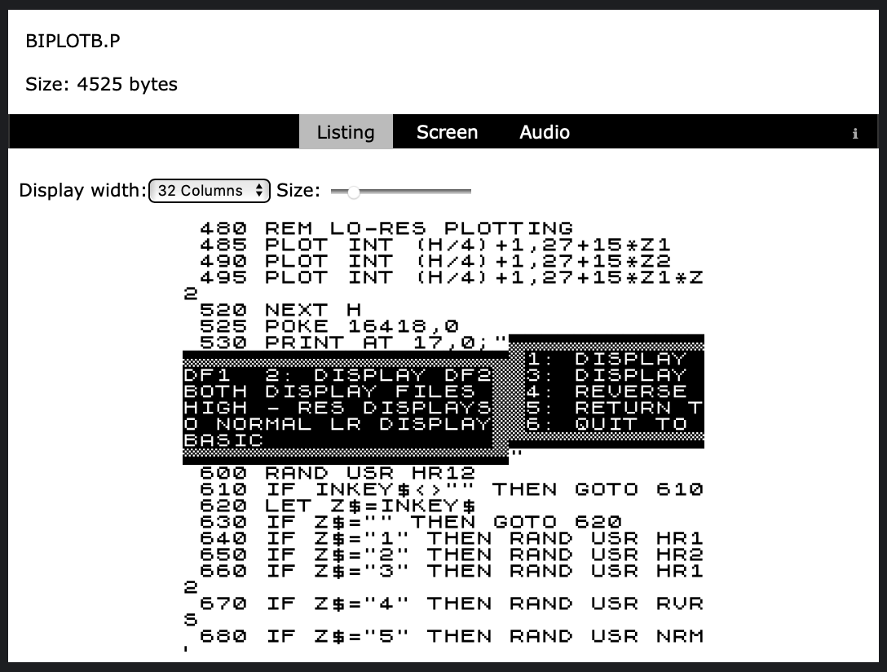
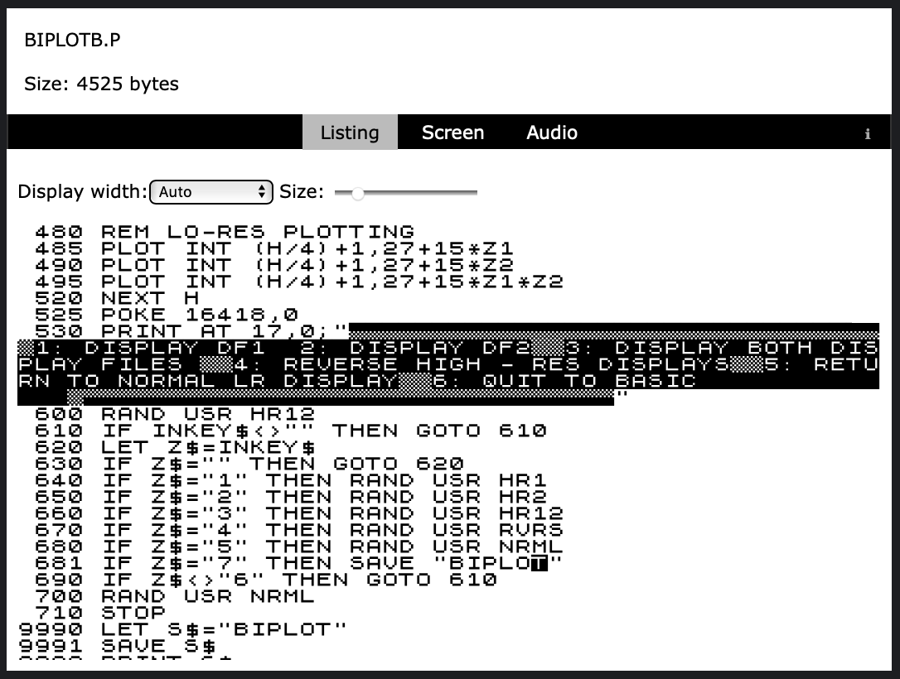
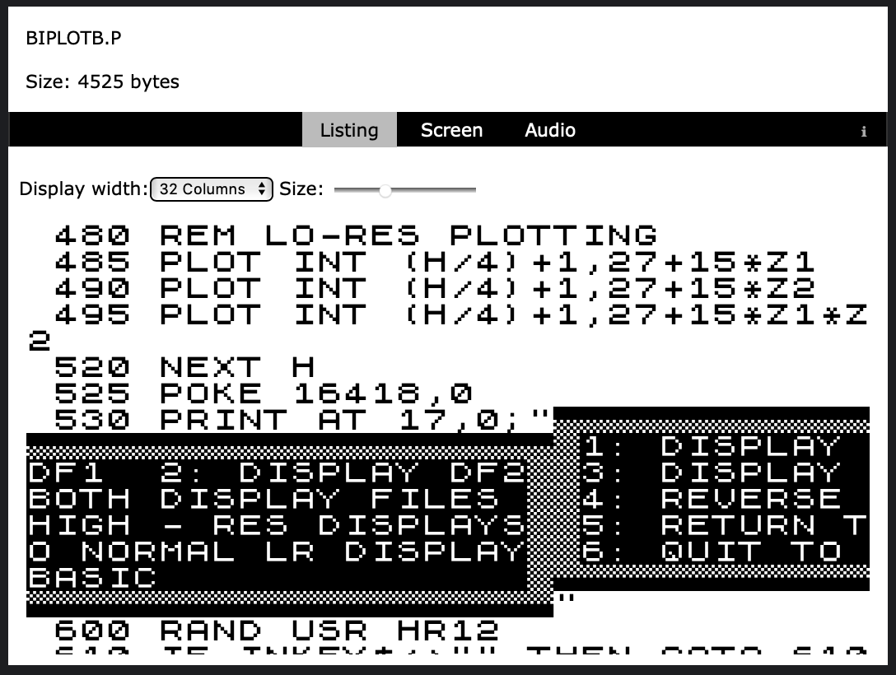
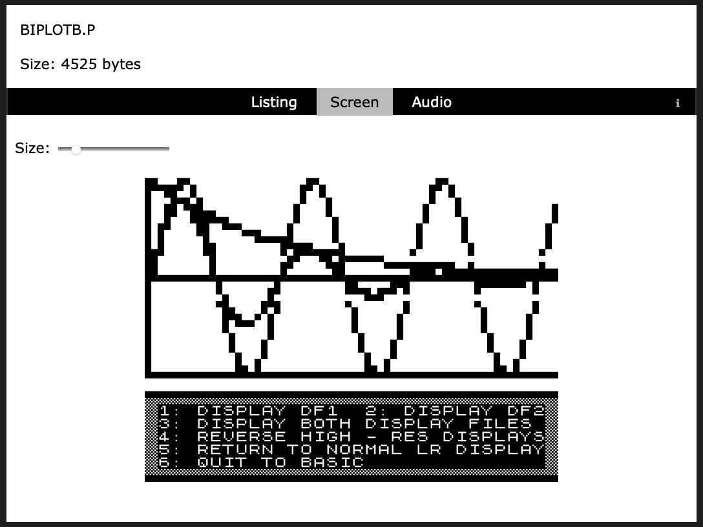
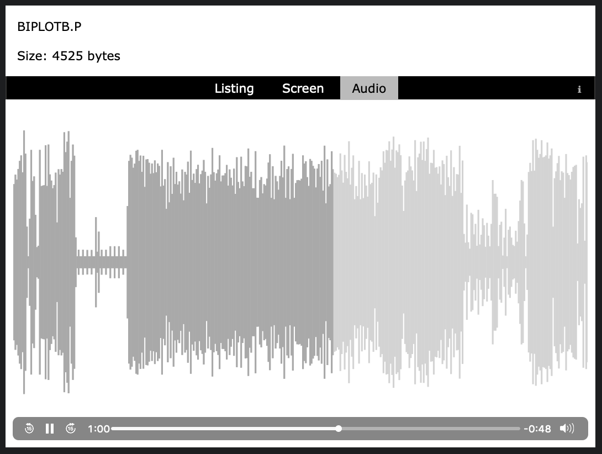
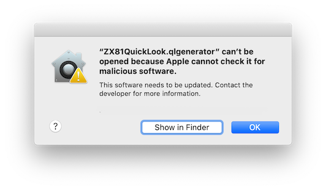
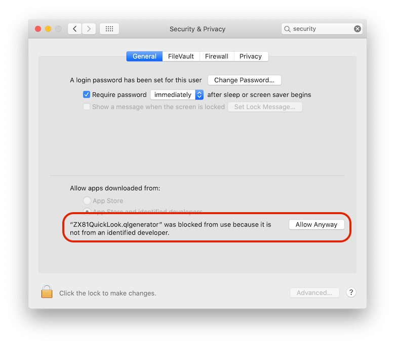
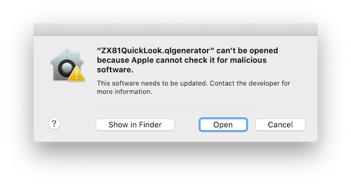

# About

ZX81QuickLook is a macOS Quicklook plugin (generator) that provides previews of ZX81 .P BASIC program files.

| Screen shots |
|:---:|
||
|*View BASIC listing in original format.*|
||
|*Listing can fill the entire width of the window.*|
||
|*Font adjustable.*|
||
|*View saved screen (when available).*|
||
|*Hear the save audio in its full screeching glory!*|

 Accuracy
-------
ZX81QuickLook aims to be as accurate as possible:

* uses an accurate replica of the ZX81 font
* great care has been taken to ensure it reproduces listings like a real ZX81 does, with the following exceptions:
	* line length is enforced to ensure uncorrupted listing
	* encountering early BASIC line termination/control codes will skip to the next BASIC line (more details on this available [here](./ZX81QuickLook))
* generates save audio output that is accurate (tested with emulators, but not yet tested on a real ZX81).

_Note_: while the audio is accurate, the displayed audio waveform is only an approximation of the generated audio.

# Installation

To install:

* [Download](https://github.com/sebastienboisvert/ZX81QuickLook/releases) the latest release zip file, and unzip the file
* Copy the `ZX81QuickLook.qlgenerator` file to either of these locations:
	* `/Library/QuickLook/` (preferred - requires system authentication)
	* `~/Library/QuickLook/` (within your ‘home’ Library/QuickLook/ folder - may not work on newer macOS releases)
* Optionally, in Terminal, run the following:

	`qlmanage -r` (may be necessary if trying to quicklook a .P file doesn’t work immediately)

*  <details>
    <summary>Users of macOS 10.15 Catalina and above: follow these additional instructions (click to expand)</summary>

    <br/>After installation, you will need to enable the generator:
    1. Try previewing a .P file from the Finder; this will cause the following alert:

      
    2. Dismiss the alert, go to System Preferences, and select the Security & Privacy section. You should see the warning highlighted here; click 'Allow Anyway' (requires system authentication)

      
    3. Try to preview a .P file again, which should trigger the following alert; click 'Open' and previews should work from then on.

      

  </details>


Once installed, your system will be able to preview any ZX81 .P file. ZX81 program files can be easily found at various archive sites, such as [this one](http://rwapsoftware.co.uk/zx81/zx81_software.html).

*Note*: If you have another Quicklook generator installed for previewing other types of .P files (such as Python files), the two generators may conflict.


## Customization

There’s some options that can be set to customize the display of the generated preview; these can be set by using the `defaults` command in Terminal, such as:

```
defaults write com.sebastienboisvert.ZX81QuickLook option value
```

and replacing _option_ and _value_ from the table below.

| Option name | Value range | Description |
| --- | :---------: | --- |
| autoWidth | YES / NO | Default to auto width; if set to YES, will format the program listing to take up all available width of the view/window automatically. This only applies to the program listing; default is NO |
| fontSize | 10 - 50 | The font size to use for the program listing; default is 15 |
| screenSize | 10 - 50 | The font size to use for the screen display; default is 15 |
| waveBars | 400 - 2000 | The number of ‘bars’ to generate for the audio waveform. A higher number will generate a more accurate rendering, but may slow down initial generation of the preview and cause higher CPU utilization during audio playback; default is 400 |
| progressFreq | 25 - 500 | The update frequency for progress display in the waveform during playback, in milliseconds. A lower value will update the progress with more accuracy, however this may lead to higher CPU utilization if the number of `waveBars` is high; default is 25 |
| audioVolume | 0.0 - 1.0 | The volume to use for audio playback. Any value from 0.0 up to 1.0 is valid (0.5 would be half-volume); default is 1.0 |
| omitAudio | YES / NO | Omit the audio in the preview; generating the audio can slow down initial display of the preview, especially on larger programs or slower machines. Setting this to YES will omit the audio in the preview. Default is NO (generates audio)
| windowHeight & windowWidth | any integer value | The window width & height to use for a preview window (triggered from the Finder). Setting this can be useful if `autoWidth` and/or custom font sizes are used to suit your preferences. The defaults are 600 for height, 800 for width. This has no effect for previews that are not in their own window (such was when shown *within* a Finder window.)|

## Future plans

This is the basic implementation of the generator I had originally envisioned, however there’s other improvements that could be added in future releases:

* Display of system and program variables in a separate tab
* Support for loading ZX81 program files in [TZX format](https://www.worldofspectrum.org/TZXformat.html)
* Implement as a [new-style Quicklook generator extension](https://nooverviewavailable.com/quicklook/) for future macOS compatibility

## More info

All sections (folders) of this project have more info related to that section, such as [the story](./ZX81QuickLook) of this project, the [parsing and output functions](./ZX81QuickLook/ZX81%20Functions), and [how to build](./ZX81QuickLook/QuickLook) it.

## Special thanks

I’d like to give thanks to the following individuals whose code/projects have made ZX81QuickLook possible:

Matthew Eagles for his [ZX81 VDU font](https://www.mattheweagles.co.uk/computing.htm)

[Ken Hoff](https://github.com/kenhoff) for the [audio visualizer](https://github.com/kenhoff/winds-waveform-example) code

Bert van Oortmarssen for the [save audio generator](https://odemar.home.xs4all.nl/zx81/zx81.htm)
